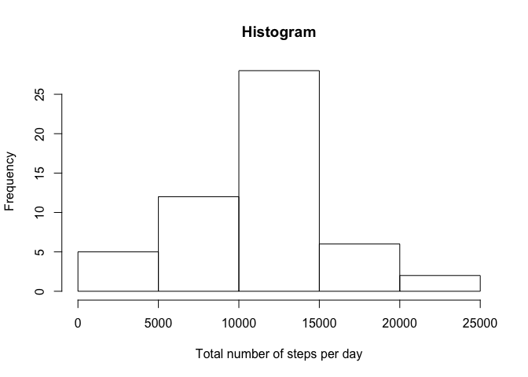
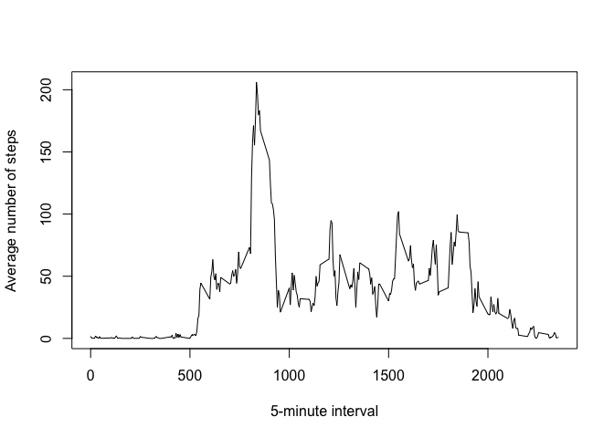
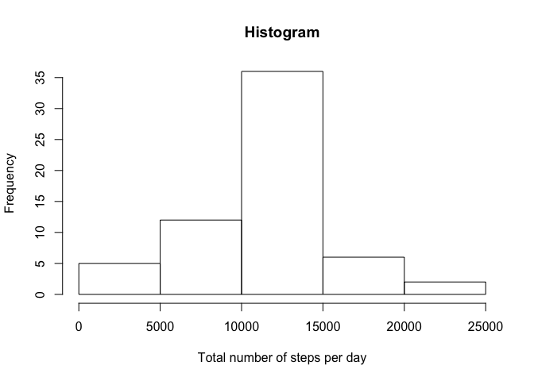
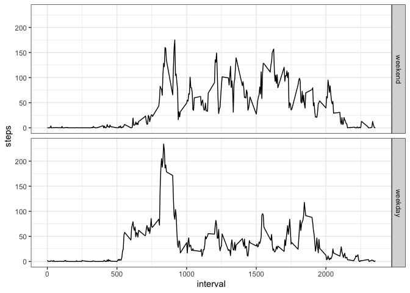

This is a R markdown file documenting the analysis of activity monitoring devices.


## Loading and preprocessing the data
Here, I download and load the data. 

```r
ifile <- 'activity_monitoring.zip'
if (!(file.exists(ifile))){
    url <- 'https://d396qusza40orc.cloudfront.net/repdata%2Fdata%2Factivity.zip'
    download.file(url,destfile=ifile,method='curl')
    unzip(ifile)
}
StepData <- read.csv('activity.csv')
```
Next, I preprocess the data by converting the date variable in actual date format and have a look at the data.

```r
StepData$date <- as.Date(StepData$date,'%Y-%m-%d')
summary(StepData)
```

```
##      steps             date               interval     
##  Min.   :  0.00   Min.   :2012-10-01   Min.   :   0.0  
##  1st Qu.:  0.00   1st Qu.:2012-10-16   1st Qu.: 588.8  
##  Median :  0.00   Median :2012-10-31   Median :1177.5  
##  Mean   : 37.38   Mean   :2012-10-31   Mean   :1177.5  
##  3rd Qu.: 12.00   3rd Qu.:2012-11-15   3rd Qu.:1766.2  
##  Max.   :806.00   Max.   :2012-11-30   Max.   :2355.0  
##  NA's   :2304
```

## What is mean total number of steps taken per day?
First, I calculate the total number of steps per day by using the aggregate function. Then, I make a histogram of the resulting total number of steps and calculate the average total number of steps per day. I learn that the person made most of the time between 10,000 and 15,000 steps per day, which is quite decent I would say.

```r
TotalNumberOfSteps <- aggregate(steps~date,StepData,sum,na.rm=TRUE)
hist(TotalNumberOfSteps$steps,main='Histogram',xlab='Total number of steps per day')
```

<!-- -->

```r
print(paste0('Average of total number of steps per day is ', mean(TotalNumberOfSteps$steps)))
```

```
## [1] "Average of total number of steps per day is 10766.1886792453"
```

```r
print(paste0('Median of total number of steps per day is ', median(TotalNumberOfSteps$steps)))
```

```
## [1] "Median of total number of steps per day is 10765"
```


## What is the average daily activity pattern?
Here, I analyze the average number of steps per 5-minute intervals using again the aggregate function. Then, I plot the average number of steps per 5-minute interval as line plot. I learn that the highest activity is in the early morning between 8 and 10 h. 

```r
AverageNumberOfSteps <- aggregate(steps ~ interval, StepData, mean)
plot(AverageNumberOfSteps$interval,AverageNumberOfSteps$steps,type='l',xlab='5-minute interval',ylab='Average number of steps')
```

<!-- -->

```r
maxInterval <- which.max(AverageNumberOfSteps$steps)
StepsInMaxInterval <- AverageNumberOfSteps[maxInterval,2]
print(paste0('The interval with the average highest number of steps is interval: ',maxInterval, ' with ',StepsInMaxInterval,' steps.'))
```

```
## [1] "The interval with the average highest number of steps is interval: 104 with 206.169811320755 steps."
```

```r
print(paste0('This interval corresponds to ',(maxInterval*5)%/%60,':',(maxInterval*5)%%60,'h'))
```

```
## [1] "This interval corresponds to 8:40h"
```

## Imputing missing values
Here, I handle the missing values. First, I look how many missing values are in total in the data set.

```r
print(paste0('The number of total NAs in the data set is: ',sum(is.na(StepData$steps))))
```

```
## [1] "The number of total NAs in the data set is: 2304"
```

```r
print(paste0('This is about ',round(sum(is.na(StepData$steps))/length(StepData$steps)*100),' % of the data'))
```

```
## [1] "This is about 13 % of the data"
```
Next, I need a strategy to fill those missing values. In the following, I investigate how the data differs per date and per interval. In particular, I analyze the mean and the number of NAs. I learn that each interval has the same number of missing values (here 8 - see NNA in the first summary). From the second summary I learn that eight days have only missing data (see NA's of mean in the second summary). Additionally, the average number of steps per day is not varying too much (compare first and fourth quantile of the second summary), whereas the average number of steps per interval is varying much stronger. Hence, I decide to fill the missing values with the *average steps per interval*. First, because I cannot use the mean of each day to fill the gaps as some days are all missing. Second, because the number of steps for each interval tends to vary less than the number of steps for each day.

```r
DataPerInterval<-aggregate(StepData$steps,by=list(StepData$interval),FUN=function(x) c(mean=mean(x,na.rm=TRUE), NNA=sum(is.na(x))))
summary(DataPerInterval$x)
```

```
##       mean              NNA   
##  Min.   :  0.000   Min.   :8  
##  1st Qu.:  2.486   1st Qu.:8  
##  Median : 34.113   Median :8  
##  Mean   : 37.383   Mean   :8  
##  3rd Qu.: 52.835   3rd Qu.:8  
##  Max.   :206.170   Max.   :8
```

```r
DataPerDate<-aggregate(StepData$steps,by=list(StepData$date),FUN=function(x) c(mean=mean(x,na.rm=TRUE), NNA=sum(is.na(x))))
summary(DataPerDate$x)
```

```
##       mean              NNA        
##  Min.   : 0.1424   Min.   :  0.00  
##  1st Qu.:30.6979   1st Qu.:  0.00  
##  Median :37.3785   Median :  0.00  
##  Mean   :37.3826   Mean   : 37.77  
##  3rd Qu.:46.1597   3rd Qu.:  0.00  
##  Max.   :73.5903   Max.   :288.00  
##  NA's   :8
```

So now I implement the above mentioned strategy by filling missing value with the corresponding mean number of steps per interval. I use the ave function.

```r
StepDataWoNa <- StepData
StepDataWoNa$steps[is.na(StepDataWoNa$steps)] <- ave(StepDataWoNa$steps, StepDataWoNa$interval,FUN=function(x) mean(x,na.rm=TRUE))[is.na(StepDataWoNa$steps)]
```

Next, I redo the analyis of question 1.

```r
TotalNumberOfStepsWoNa<- aggregate(steps~date,StepDataWoNa,sum,na.rm=TRUE)
hist(TotalNumberOfStepsWoNa$steps,main='Histogram',xlab='Total number of steps per day')
```

<!-- -->

```r
print(paste0('Average of total number of steps per day is ', mean(TotalNumberOfStepsWoNa$steps)))
```

```
## [1] "Average of total number of steps per day is 10766.1886792453"
```

The *mean* total number of steps per day do not change whether I include NAs or replace them with mean value per interval. Although this result may seem at the first glance unexpected, it can be explained due to the fact that only whole days are missing and not single intervals. If NAs are included, those (eight) days are simple ignored. If NAs are replaced, those (eight) days contain the mean total number of steps. Please compare the minimum of the date from the summaries below. However, the *median* slightly changes as well as the first and fourth quantiles. 

```r
summary(TotalNumberOfSteps)
```

```
##       date                steps      
##  Min.   :2012-10-02   Min.   :   41  
##  1st Qu.:2012-10-16   1st Qu.: 8841  
##  Median :2012-10-29   Median :10765  
##  Mean   :2012-10-30   Mean   :10766  
##  3rd Qu.:2012-11-16   3rd Qu.:13294  
##  Max.   :2012-11-29   Max.   :21194
```

```r
summary(TotalNumberOfStepsWoNa)
```

```
##       date                steps      
##  Min.   :2012-10-01   Min.   :   41  
##  1st Qu.:2012-10-16   1st Qu.: 9819  
##  Median :2012-10-31   Median :10766  
##  Mean   :2012-10-31   Mean   :10766  
##  3rd Qu.:2012-11-15   3rd Qu.:12811  
##  Max.   :2012-11-30   Max.   :21194
```

## Are there differences in activity patterns between weekdays and weekends?
First, I make a logical vector stating TRUE for weekends and FALSE for weekdays. Then, I convert this logical vector into a factor and add it to the data.

```r
weekend<-format(StepData$date, "%u") %in% c(6, 7)
StepData$day <-factor(weekend,levels=c('TRUE','FALSE'),labels=c('weekend','weekday'))
```
Next, I divide the data set into weekdays and weekends and plot the average number of steps per interval for weekdays and weekends individually. I learn that the onset (i.e. start of the day) is later on weekends (around 8h) than on weekdays (around 5h). However, the total number of steps seems to be higher on weekends than on weekdays.

```r
library(ggplot2)
AverageNumberOfStepsWeek <- aggregate(steps ~ interval + day, StepData, mean)
ggplot(AverageNumberOfStepsWeek,aes(interval,steps)) +geom_line() +facet_grid(AverageNumberOfStepsWeek$day)+theme_bw()
```

<!-- -->

```r
print(paste0('Average number of steps on weekdays ',mean(AverageNumberOfStepsWeek[AverageNumberOfStepsWeek$day=='weekday',3])))
```

```
## [1] "Average number of steps on weekdays 35.337962962963"
```

```r
print(paste0('Average number of steps on weekends ',mean(AverageNumberOfStepsWeek[AverageNumberOfStepsWeek$day=='weekend',3])))
```

```
## [1] "Average number of steps on weekends 43.078373015873"
```
